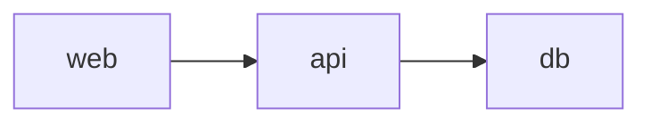
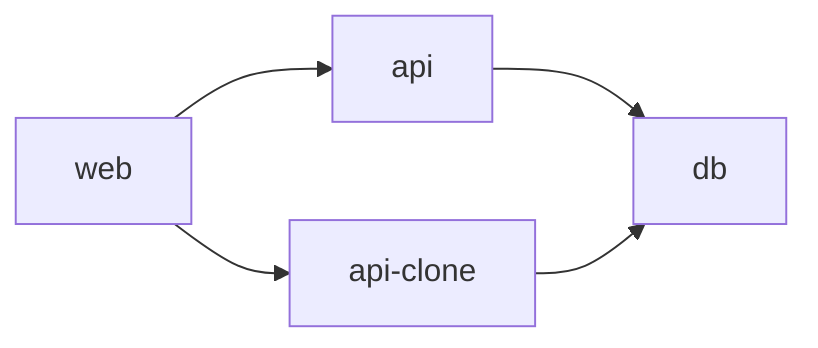

# tiny-node-app

Use dev spaces to debug your app in your AKS cluster.

From this call hierarchy in your dev space (e.g. `demospace`):

To this call hierarchy in your child dev space (e.g. `devspace/janne`):

