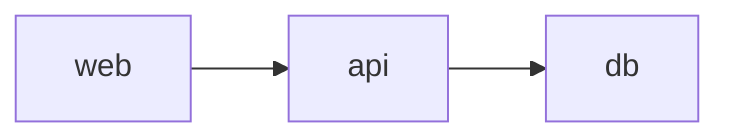
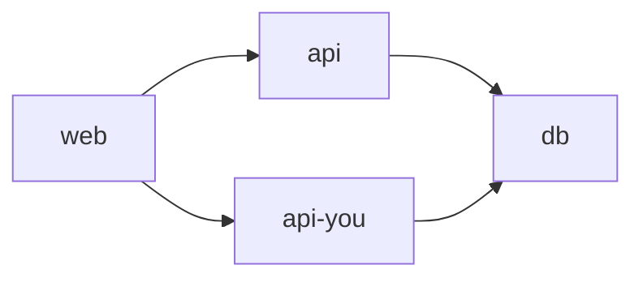

# tiny-node-app

Use dev spaces to debug app in your AKS cluster.

From this call hierarchy:

```mermaid
graph LR;
    web-->api;
    api-->db;
```

To this call hierarchy:

```mermaid
graph LR;
    web-->api;
    web-->api-you;
    api-->db;
    api-you-->db;
```
