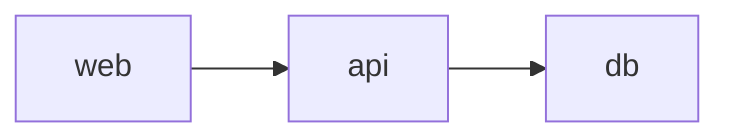
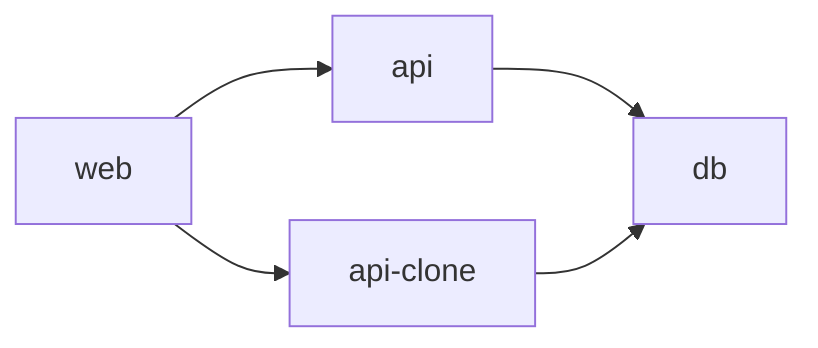

# tiny-node-app

## Demo setup

Use dev spaces to debug your app in your AKS cluster.

From this call hierarchy in your dev space (e.g. `demospace`):

To this call hierarchy in your child dev space (e.g. `devspace/janne`):

Above `api-clone` is now something that you can easily debug locally.

## Links

[Azure Dev Spaces documentation](https://docs.microsoft.com/en-us/azure/dev-spaces/)

[Azure / dev-spaces](https://github.com/Azure/dev-spaces)
