# tiny-node-app

## Demo setup

Use dev spaces to debug your app in your AKS cluster.

From this call hierarchy in your dev space (e.g. `demospace`):

To this call hierarchy in your child dev space (e.g. `devspace/janne`):

Above `api-clone` is now something that you can easily debug locally.

## Team development with dev spaces

You can use dev spaces to share different microservices between your team members.
In below example services `A`, `B`, `C`, `D`, `E` and `F` are baseline
versions of the services. In this example these are running in dev spaces
enabled namespace `integration`.

Those baseline services are then overridden in feature specific dev space
with services `feature-C`, `feature-D` and `feature-E`. These are running
in child dev space `integration/feature`.

And developer working in this feature has even created child dev space to
override one specific service with `feature-D-dev` and that is running
in child dev space `integration/feature/dev`:

## Links

[Azure Dev Spaces documentation](https://docs.microsoft.com/en-us/azure/dev-spaces/)

[Azure / dev-spaces](https://github.com/Azure/dev-spaces)
