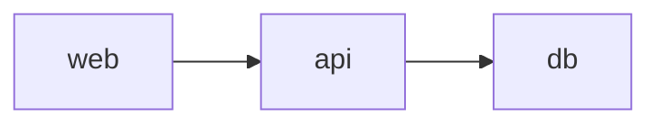
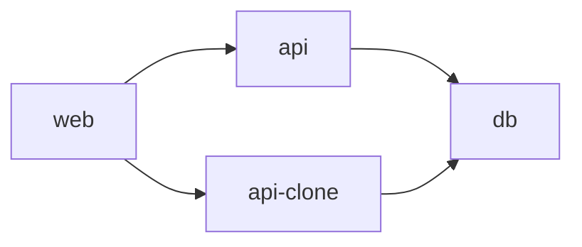
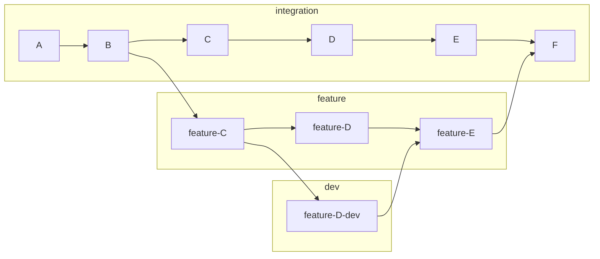

# Diagrams in Mermaid

```mermaid
graph LR;
    web-->api;
    api-->db;
```

```mermaid
graph LR;
    web-->api;
    web-->api-clone;
    api-->db;
    api-clone-->db;
```

```mermaid
graph LR;
subgraph integration
    A-->B;
    B-->C;
    C-->D;
    D-->E;
    E-->F;
end
    B-->feature-C;
subgraph feature
    feature-C-->feature-D;
    feature-D-->feature-E;
    feature-E-->F;
end
    feature-C-->feature-D-dev;
subgraph dev
    feature-D-dev-->feature-E;
end
```
